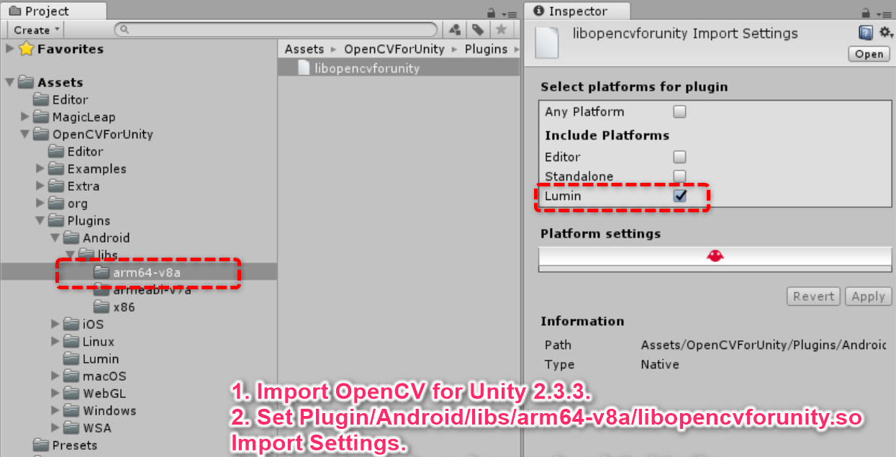
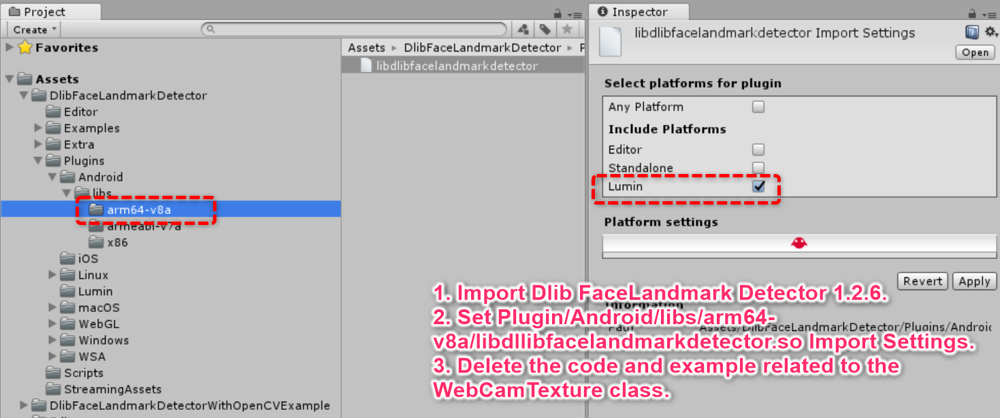

# MagicLeap With DlibFaceLandmarkDetector Example

## Environment
* MagicLeapOne Lumin OS 0.94
* Unity 2018.1.9f2-MLTP10 (64-bit)  
* [OpenCV for Unity](https://assetstore.unity.com/packages/tools/integration/opencv-for-unity-21088?aid=1011l4ehR) 2.3.3+ 
* [Dlib FaceLandmarkDetector](https://assetstore.unity.com/packages/tools/integration/dlib-facelandmark-detector-64314?aid=1011l4ehR) 1.2.6+ 

## Setup
1. Download the latest release unitypackage. [MagicLeapWithDlibFaceLandmarkDetectorExample.unitypackage](https://github.com/EnoxSoftware/MagicLeapWithDlibFaceLandmarkDetectorExample/releases)
1. Create a new project. (MagicLeapWithDlibFaceLandmarkDetectorExample)
1. Import the OpenCVForUnity.
    * Setup the OpenCVForUnity. (Tools > OpenCV for Unity > Set Plugin Import Settings)
    * Set "Assets/OpenCVForUnity/Plugin/Android/libs/arm64-v8a/libopencvforunity.so" Import Settings.
    * Delete the code and example related to the WebCamTexture class.
    
1. Import the DlibFaceLandmarkDetector.
    * Setup the DlibFaceLandmarkDetector. (Tools > Dlib FaceLandmarkDetector > Set Plugin Import Settings)
    * Set "Assets/Dlib FaceLandmarkDetector/Plugin/Android/libs/arm64-v8a/libdlibfacelandmarkdetector.so" Import Settings.
    * Delete the code and example related to the WebCamTexture class.
    
1. Import the MagicLeapWithOpenCVForUnityExample.unitypackage.
1. Add the "Assets/MagicLeapWithDlibFaceLandmarkDetectorExample/*.unity" files to the "Scenes In Build" list in the "Build Settings" window.
1. Check CameraCapture checkbox in Publishing Settings.
1. Build and Deploy to MagicLeap.

## ScreenShot
 