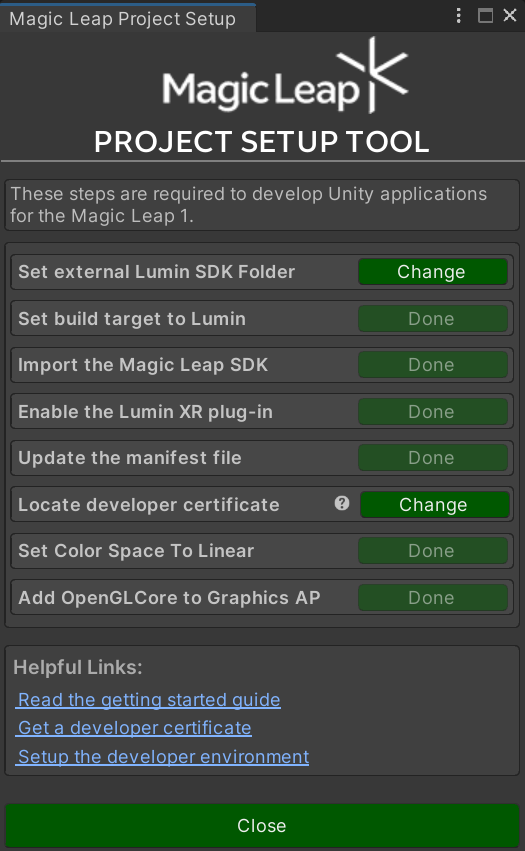
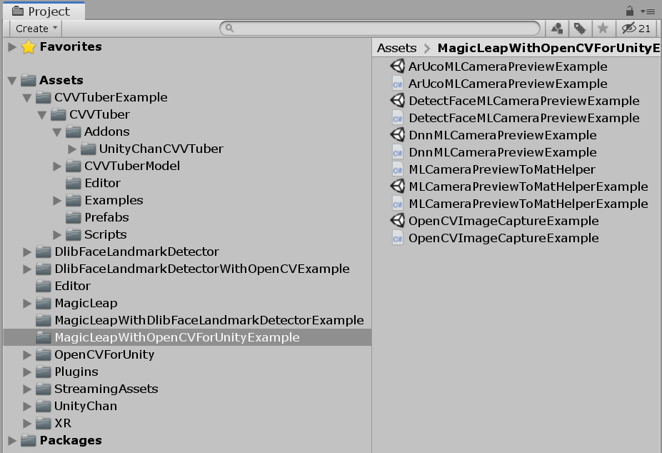
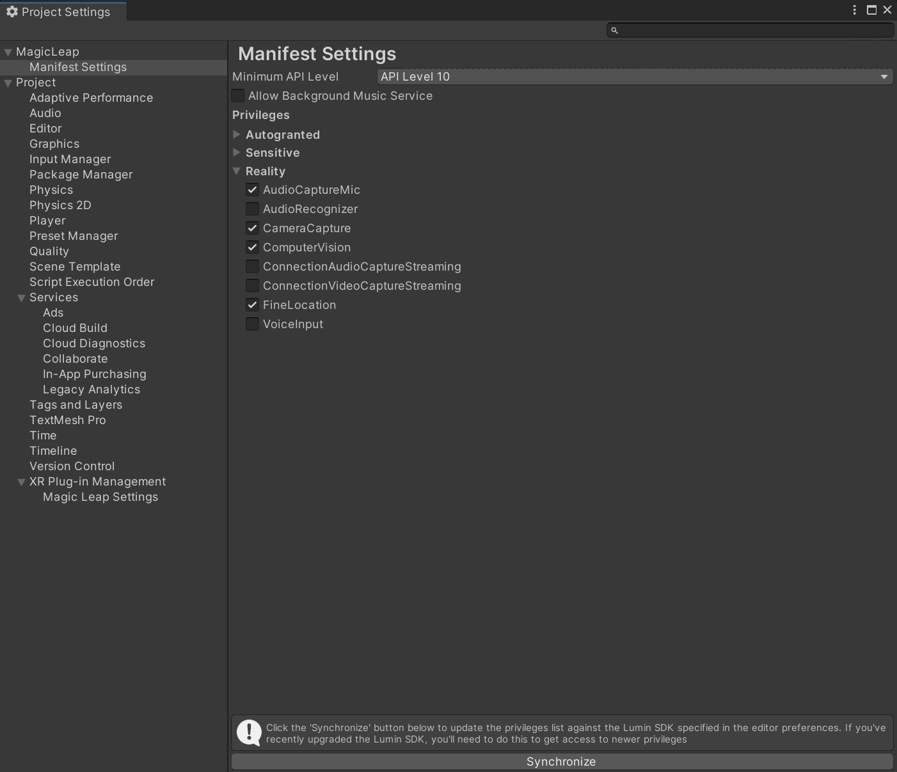

# MagicLeap With DlibFaceLandmarkDetector Example

## Environment
* MagicLeapOne Lumin OS 0.98.30
* Lumin SDK 0.26
* Unity 2020.3.29f1 (64-bit)  
* [OpenCV for Unity](https://assetstore.unity.com/packages/tools/integration/opencv-for-unity-21088?aid=1011l4ehR) 2.4.7+ 
* [Dlib FaceLandmarkDetector](https://assetstore.unity.com/packages/tools/integration/dlib-facelandmark-detector-64314?aid=1011l4ehR) 1.3.3+ 

## Setup
1. Download the latest release unitypackage. [MagicLeapWithDlibFaceLandmarkDetectorExample.unitypackage](https://github.com/EnoxSoftware/MagicLeapWithDlibFaceLandmarkDetectorExample/releases)
1. Create a new project. (MagicLeapWithDlibFaceLandmarkDetectorExample) and [setup UnityProject](https://developer.magicleap.com/en-us/learn/guides/import-the-magic-leap-unity-package).
    * Import the Magic Leap SDK for Unity asset from the [Unity Asset Store](https://assetstore.unity.com/packages/tools/integration/magic-leap-sdk-for-unity-194780).
    
    * Setup MagicLeap PROJECT SETUP TOOL.
    
    * Copy [the "MagicLeap" folder](https://github.com/magicleap/MagicLeapUnityExamples/tree/main/Assets) to your project.
1. Import the OpenCVForUnity.
    * Setup the OpenCVForUnity. (Tools > OpenCV for Unity > Set Plugin Import Settings)
1. Import the DlibFaceLandmarkDetector.
    * Setup the DlibFaceLandmarkDetector. (Tools > Dlib FaceLandmarkDetector > Set Plugin Import Settings)
    * Move the "DlibFaceLandmarkDetector/StreamingAssets/" folder to the "Assets/" folder.
1. Import the MagicLeapWithDlibFaceLandmarkDetectorExample.unitypackage.
   
1. Add the "Assets/MagicLeapWithDlibFaceLandmarkDetectorExample/*.unity" files to the "Scenes In Build" list in the "Build Settings" window.
1. Check CameraCapture and ComputerVision checkbox in Publishing Settings.
   
1. Build and Deploy to MagicLeap.

## ScreenShot
 

